# VPC and ECS Networks

## VPC & Networking

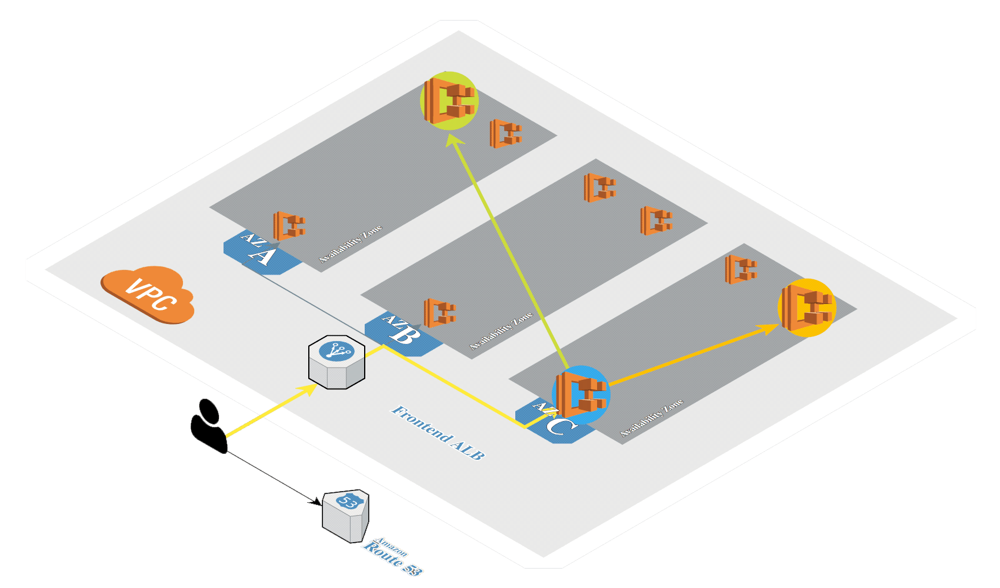

## ECS

ECS helps in managing the execution of fleets of containers in a high available manner and monitors resource consumption and requirements.

- Helps in scaling elastically and integrate with other Services along with load balancing
- Managing containers through programmatic API and AWS CLI tools such as ECR and EC2
- Secure through policies, availability, granular control over isolated resources and their allocation. Also, allows usage of VPC for clusters and setup security groups to manage traffic.

There are three main components:

- Cluster
- Task
- Service

### Cluster

- Group of EC2 instances spread across multiple availability zones, that are running the AWS ECS container agent.
- Agents allow EC2 instances to talk with the backend logic of ECS, which allows for resource management, lifecycle coordination and efficient scheduling.
- Containers in a cluster are grouped in task and asked to EC2 to run them. They can have mix of instance types and other EC2 specifications.

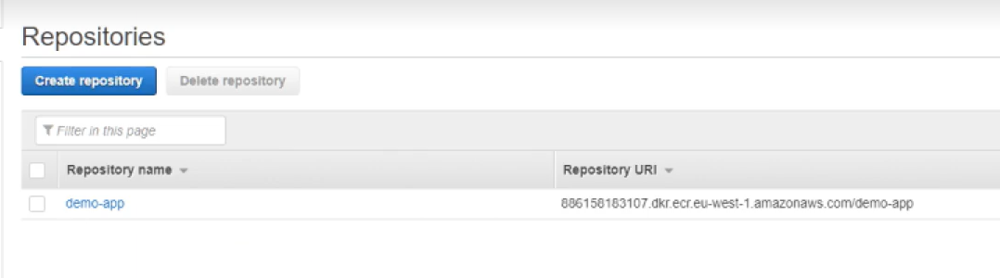

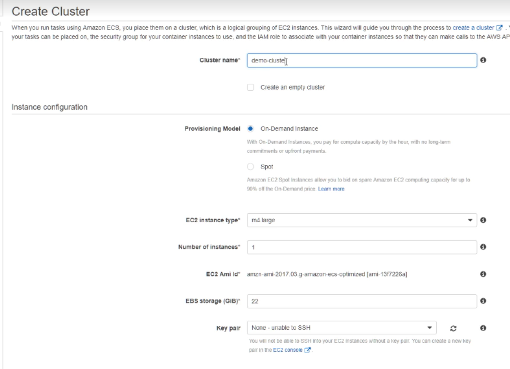

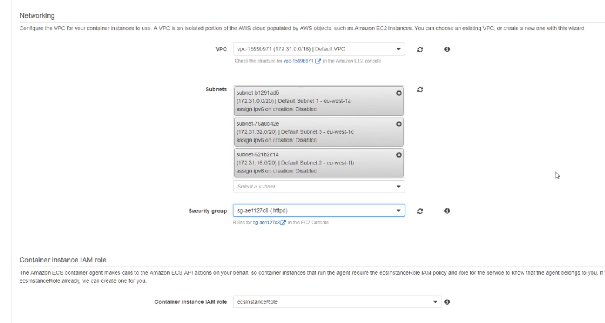

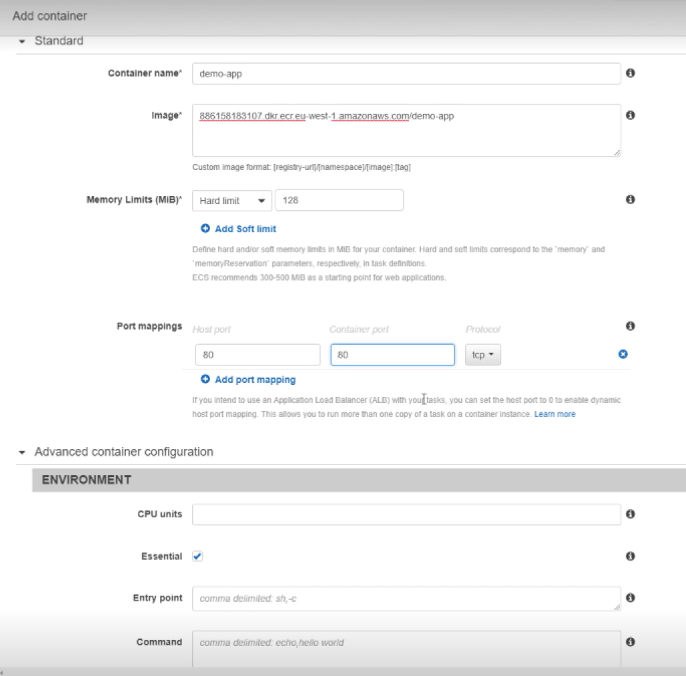

### Task

- Task definition is a file that describes one or more containers that should run together and are deployed as a single unit.
- Task is one instantiation of a task definition that runs all containers together in the AWS EC2 instance.

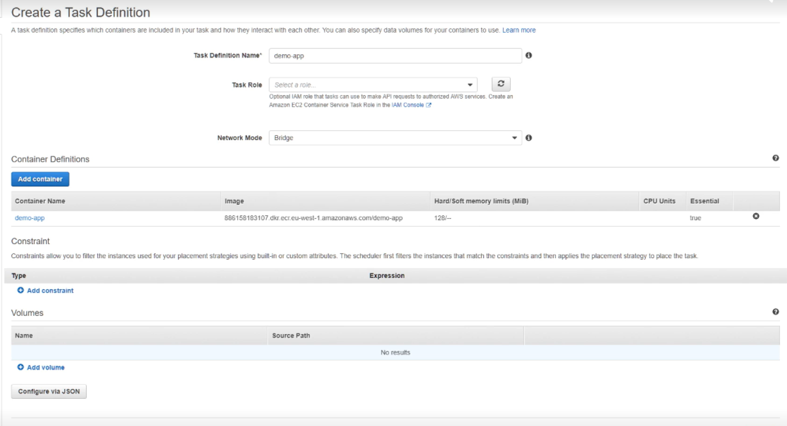

- Schedule tasks based on the task definition and run them in the cluster

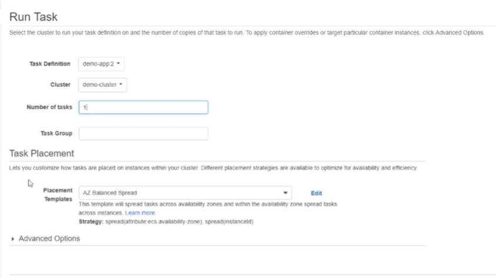

### Service

- Service is where all of this functionalities are connected together, and it schedules tasks based on their definition in the cluster. Defines min and max no of tasks desired in the cluster and also helps in restarting failed tasks along with scalability.

- Configure the service to run the tasks in the cluster

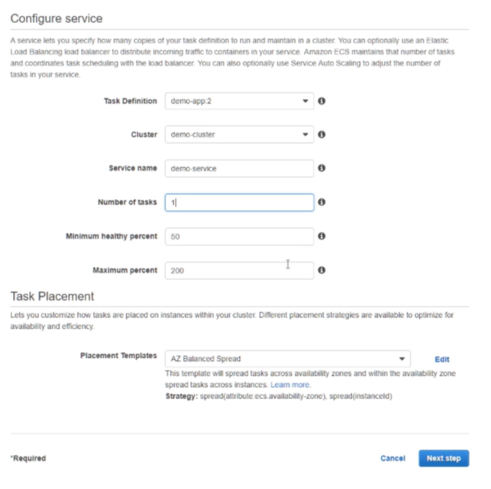

- Set Application Load Balancer to route traffic to the ECS service

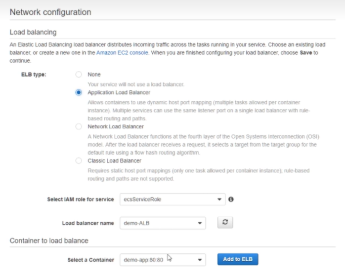
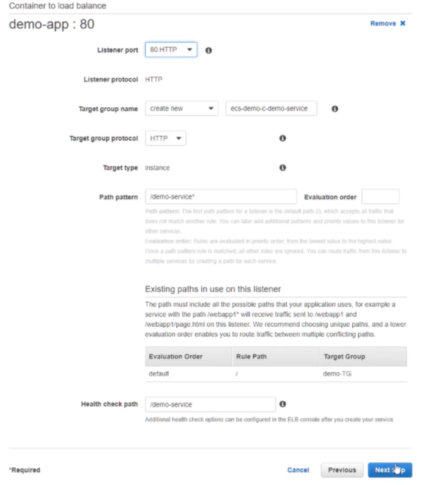

- Add Auto Scaling to the ECS service

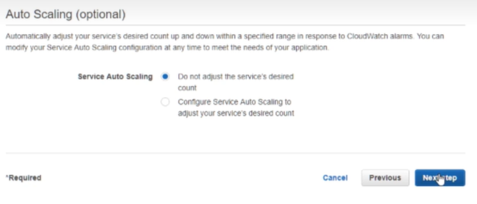

- Add CloudWatch to monitor the ECS service

- Review and create the ECS service

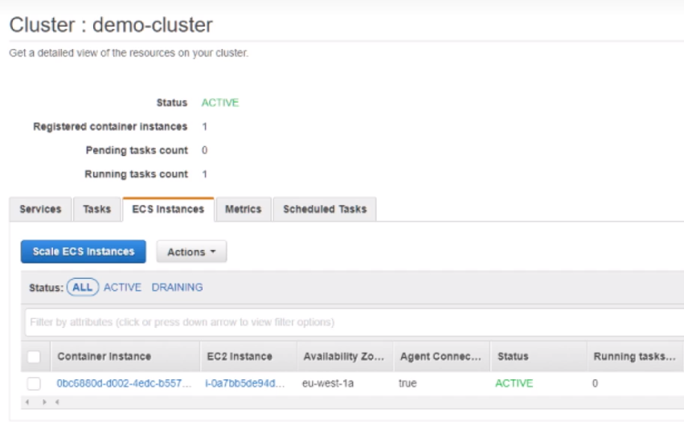

- The apps running in the cluster can be accessed through the EC2 ALB DNS name

## CICD

To facilitate the deployment of the ECS service, we can use the CICD pipeline to automate the process.

We can have the following stages in the pipeline:

1. Monitor the source code repository for changes
2. Build the Docker image
3. Push the Docker image to ECR or image repository
4. Update the ECS service with the new image
